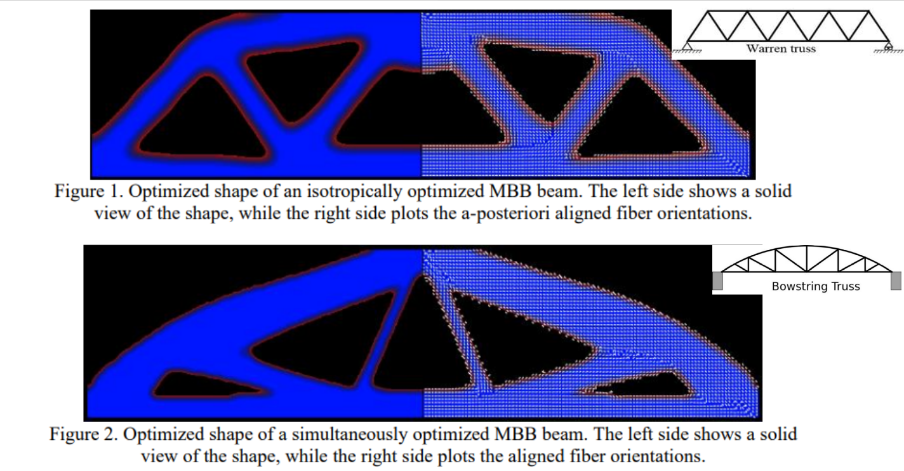
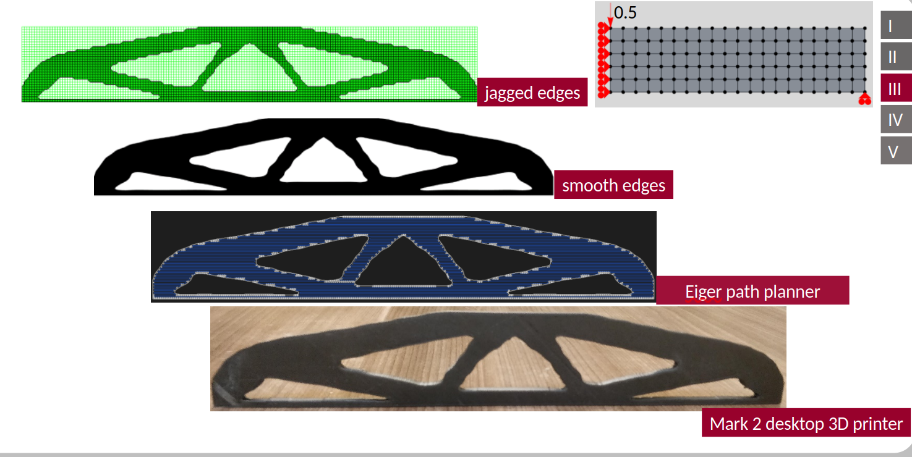
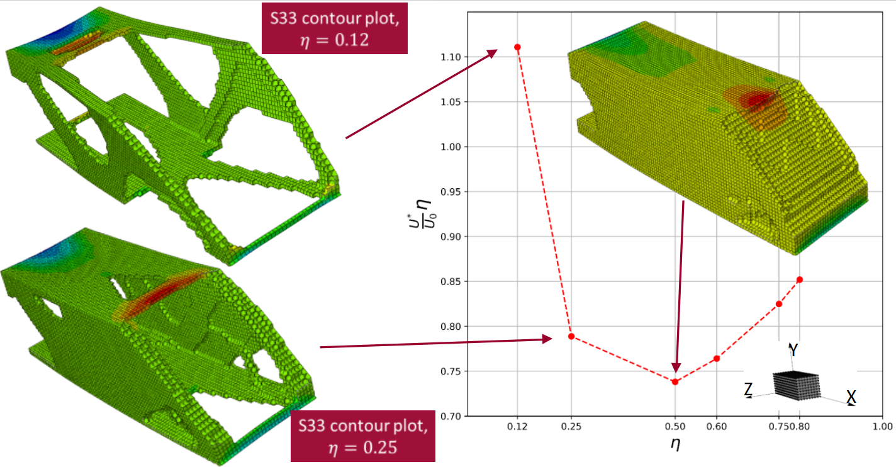
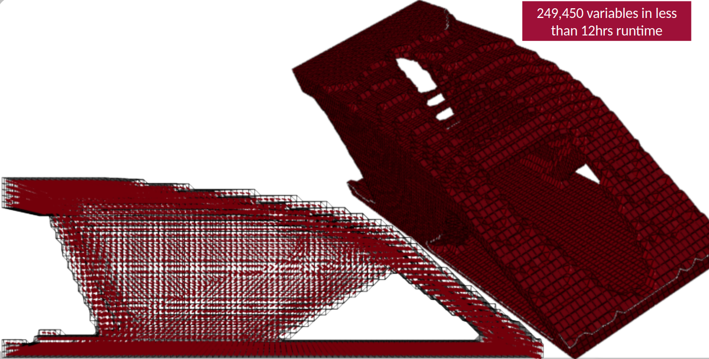

The Messerschmitt-Bolkow-Blohm (MBB) beam problem is a simple topology optimization problem widely known in the community. It consists of a 2D isotropic simply supported beam as shown below. And the objective is to maximize its stiffness-to-weight ratio.

I learned about it from Ole Sigmund and team in their [Topology Optimization - Theory, Methods and Applications](https://lifelonglearning.dtu.dk/en/uncategorized/single-course/topology-optimization-theory-methods-and-applications/) course. And found it quite useful for my research.

The nice feature about the original MBB beam problem is that it converges to a Warren-type truss with bars arranged in equilateral triangle patterns. Thus, making it intuitive to check the validity of a given topOpt algorithm. 

In general, topology optimizers do not converge to intuitive architectures. Which makes the MBB beam problem a great sanity check. However, during my research I realized that silght modifications to this MBB problem also result in very insightful architectures. The sections below showcase 3 MBB beams I modified during my research.  

## fiber-reinforced 2D MBB

What if the MBB problem formulation drops the isotropic material for a fiber-reinforced composite? One would be tempted with aligning the fiber orientations along the bars of the isotropically generated Warren truss. A sequential design approach. This certainly results in a higher stiffness-to-weight ratio, but we would be leaving performance on the table. To truly benefit from the anisotropy of the fiber reinforcement, we have to simultaneously optimize the topology of the beam and the fiber path. In this [SAMPE paper](https://d1wqtxts1xzle7.cloudfront.net/114748713/arris_composites_paper_camx_2020-libre.pdf?1716074013=&response-content-disposition=inline%3B+filename%3DThe_Convergence_of_Composites_and_Topolo.pdf&Expires=1746897899&Signature=b3bgc1RB2N-pq98KPnRz5gyQ5mE61dc8ROk2PGDU7BLt7rh~h5H4zWTuftZxIeWAMF9Ol7Vjrb3ZxI2N~XEEWFLvTjLtKJjA8x-Ng7sORj5M7dQvnnf4InBFC1heu19HXs8WVkE3PvLTu2gqhYtbW4f9ks4w-ZuUdfy-VSviUNXI0hczSi975wpC0iZ-1ZqX1sMjeNvWtNcGXtrIJ4hxZN9JqT9RYxNrfJMA-Oeao~58-Kly4EUdGif5AvvKYSXxg7dOnJH9vLWK~oZwKk7bc5Q3B7xJQ5~FVzwblv-35YGvIlTPMXytmhb7MNQLGNNc7R95ll017IV~RX~uJPAiXw__&Key-Pair-Id=APKAJLOHF5GGSLRBV4ZA) that I co-authored I show how a simultaneous topOpt results in better stiffness-to-weight ratio of the MBB beam, and how a new architecture emerges: a bowstring truss. 

The above image, extracted from the SAMPE paper, shows these architectures.

Not all composites manufacturing processes are created equal. During my PhD I only had access to a Mark 2 desktop 3D printer, which did not provide me with much fine-grained control of the fiber path. So, the image below shows the architecture one gets when altering the MBB beam problem formulation to just use an anisotropic material with 0deg as its preferred direction.

Besides a slightly less pronounced bow, the bowstring truss concept is still present. Of course, its stiffness-to-weight ratio is not as good. But design is full of trade-offs, and a sub-optimal yet manufacturable composite MBB beam was a worthwhile trade I made at the time.

Interested in what architectures one gets when the preferred direction is other than 0 degrees? check out my [dissertation](https://scholarcommons.sc.edu/etd/5457/).

## isotropic 3D MBB

What if the MBB problem goes full 3D? well, now we have bending in both planes. Although longitudinal bending is still dominant, one would expect the architecture to grow beams in the perpendicular plane as well.

The image below shows exactly that, for low **eta** values. **eta** is the fraction between the target volume and the baseline volume.

For larger **eta** values the architecture becomes a closed shell. Why? topology optimizers don't explain themselves, but my conjecture is that it is to prevent the side walls from opening up. And the S33 contour plots in the image seem to agree. As **eta** is reduced, the outer side-walls open up. Which increases the stress **S33** that the remaining z-axis bars have to bear. No wonder, when given more material it keeps adding more z-axis bars until it becomes a shell.

## simultaneous topOpt of a 3D MBB

If you already read the previous examples, this modification of the MBB problem to be 3D and fiber-reinforced comes at no surprise. Even the resulting architecture (shown below) is not too earth shattering.

Like the 2D MBB fiber-reinforced beam it has an upper bow. Similar to the 3D isotropic MBB beam it has grown a few z-axis bars. The only new feature is that the side walls now rock a plus/minus 45degree reinforcement.

What is noteworthy about this MBB problem is the **curse of dimensionality**. Even with symmetry conditions, I ended up with about a quarter million design variables. If we do not choose or develop scalable optimization algorithms, these problems would take so much time to compute that they become intractable. 
